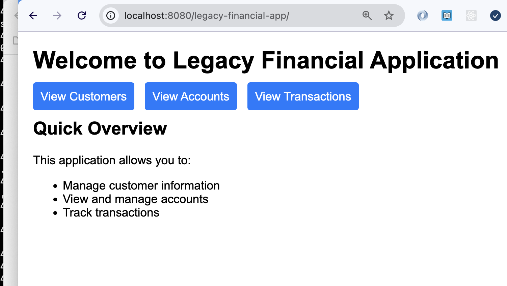
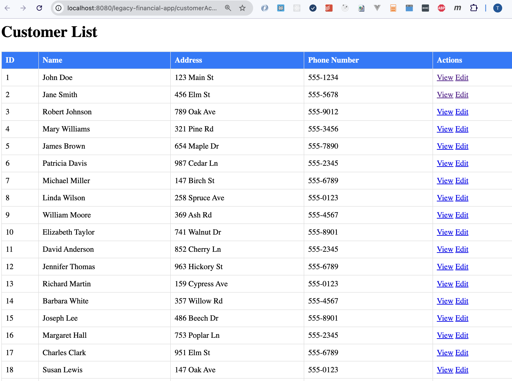
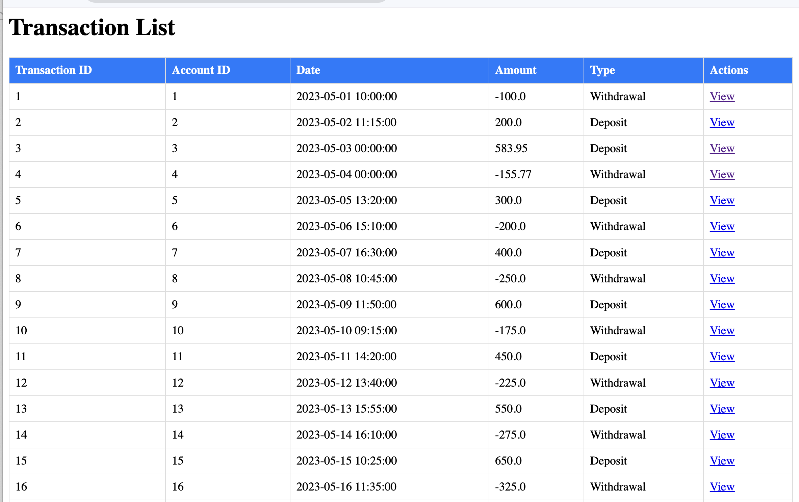

# Refactoring exercise: Legacy Financial Application

This is a legacy financial data management application built with Apache Struts 1.3.x.
The reason for this application existing is to investigate how AI tools can be used
to refactor legacy software into modern stacks.

## Requirements

- Docker
- Docker Compose

## Setup and Running

Build and run the application:

```bash
docker-compose up --build
```

When DB and the app are up, go to `http://localhost:8080/legacy-financial-app` in your browser.

## Screenshots







